<p align="center">
  
</p>

<p align="center">
  <a href="https://github.com/Anubhav2912">
    
  </a>
  <a href="https://linkedin.com/in/anubhav-singh29">
    
  </a>
  <a href="mailto:ak23.ideal@gmail.com">
    
  </a>
  
</p>

---

## 👨‍💻 Developer Profile

```text
Name        : Anubhav Kumar Singh
Education   : B.Tech. CSE — Cloud Computing & Automation
University  : VIT Bhopal University

Primary     : Java Backend Development
Core        : Spring Boot • Spring Security • Spring Cloud
Architecture: REST APIs • Microservices • API Gateway
Cloud       : AWS • GCP
Data        : MySQL • PostgreSQL • Oracle DB • MongoDB
Security    : JWT • OAuth • RBAC • Okta Security
```

I enjoy building backend applications, designing RESTful services, working with distributed architectures, and exploring cloud-based systems.

---

## ⚡ Tech Stack

### ☕ Backend & Frameworks

<p>
  
  
  
  
  
  
</p>

### 🔗 APIs, Architecture & Security

<p>
  
  
  
  
  
  
  
</p>

### ☁️ Cloud & DevOps

<p>
  
  
  
  
  
</p>

### 🗄️ Databases

<p>
  
  
  
  
</p>

### 🧩 Languages & Supporting Tools

<p>
  
  
  
  
</p>

---

## 📊 GitHub Analytics

<p align="center">
  
  
</p>

<p align="center">
  
</p>

---

## 📈 Contribution Activity

<p align="center">
  
</p>

<p align="center">
  
</p>

---

## 🏆 Achievements

<p align="center">
  
</p>

---

## 🚀 Selected Projects

| Project | Focus | Technologies |
| :--- | :--- | :--- |
| **Apistry** | API testing & collaboration platform | `Java` `Spring Boot` `Spring Security` `PostgreSQL` `Docker` |
| **Microservices-Based Project** | Distributed services, API Gateway & Security | `Java` `Spring Boot` `Spring Cloud` `JWT` `Okta` |
| **AgroVITa** | Secure agricultural platform & REST APIs | `Java` `Spring Boot` `Spring Security` `JPA` `MySQL` |
| **Weather Forecast Website** | Weather data backend & API models | `Java` `Spring Boot` `REST APIs` |

> 🔗 Project source code and implementation details are available in my repositories.

---

## 🎓 Education & Certifications

**B.Tech. in Computer Science Engineering**

*Specialization: Cloud Computing and Automation*

**VIT Bhopal University** · **CGPA: 8.66**

### Certifications

- **AWS Solutions Architect Associate Course** — AWS Educate
- **High Performance Coding: Advanced DSA in Java** — IAMNEO

---

## 🤝 Connect With Me

<p align="center">
  <a href="https://linkedin.com/in/anubhav-singh29">
    
  </a>
  <a href="mailto:ak23.ideal@gmail.com">
    
  </a>
  <a href="https://github.com/Anubhav2912">
    
  </a>
</p>

---

<p align="center">
  
</p>
